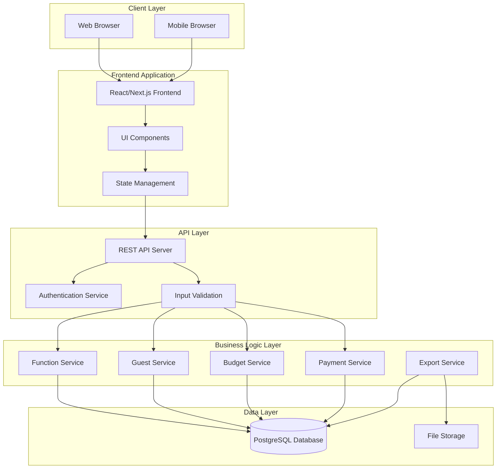
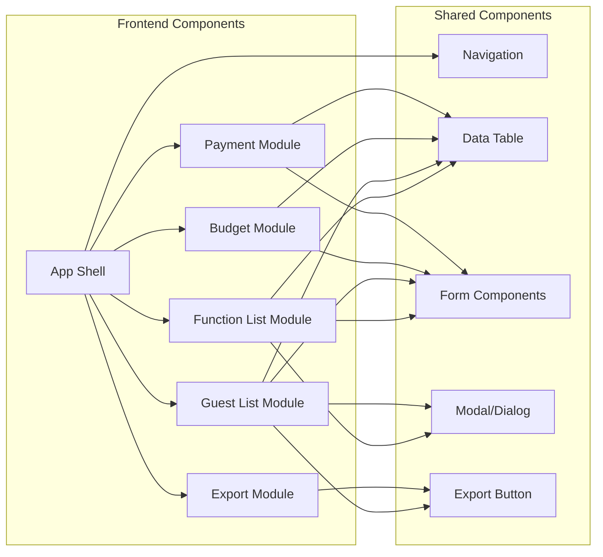
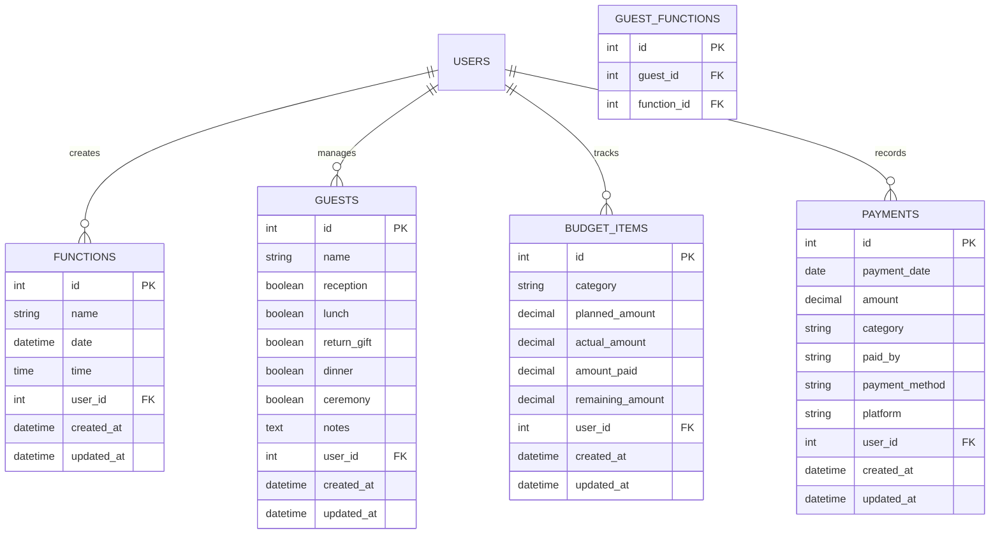
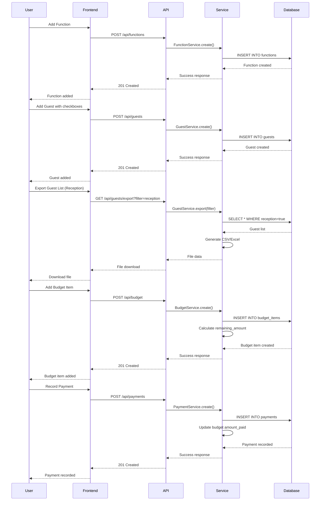
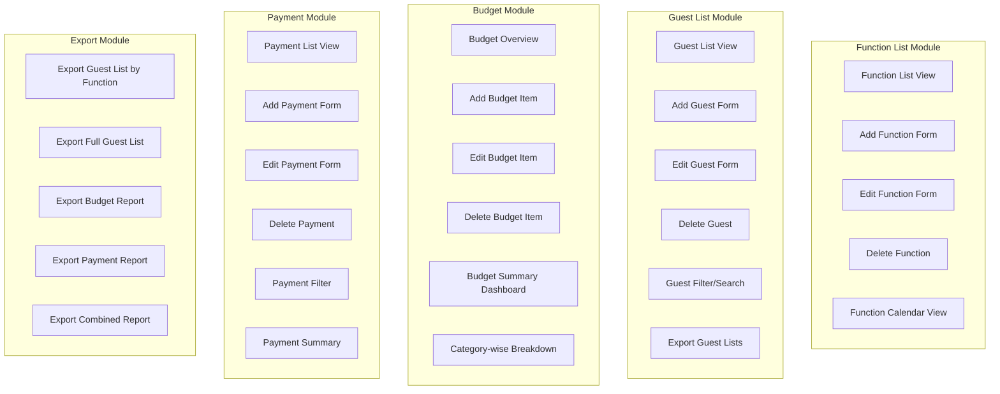
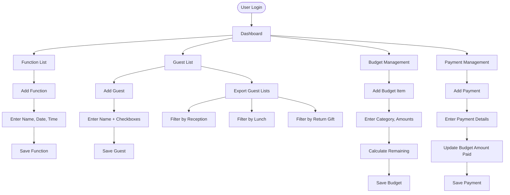
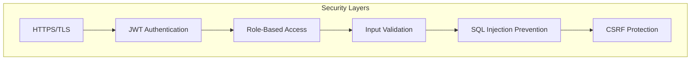
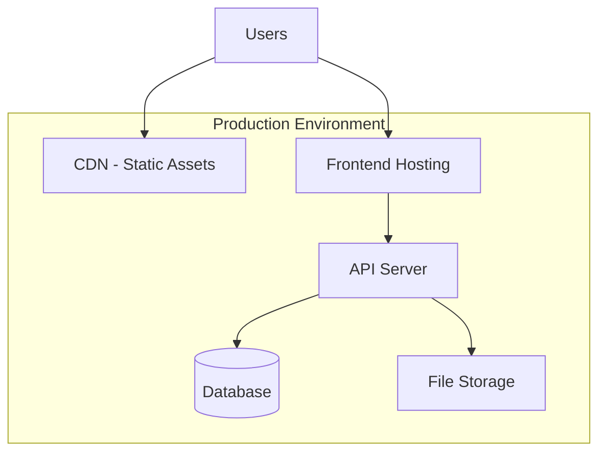

# Wedding Management Web App - Architecture Diagram

## 1. System Architecture Overview



## 2. Component Architecture



## 3. Database Schema Architecture



## 4. Data Flow Architecture



## 5. Module Breakdown



## 6. Technology Stack Recommendation

### Frontend
- **Framework**: React.js / Next.js
- **State Management**: Redux Toolkit / Zustand
- **UI Library**: Material-UI / Ant Design / Tailwind CSS
- **Form Handling**: React Hook Form
- **Data Table**: TanStack Table / Material-UI DataGrid
- **Export**: SheetJS (xlsx) / CSV export

### Backend
- **Runtime**: Node.js
- **Framework**: Express.js / Nest.js
- **ORM**: Prisma / TypeORM / Sequelize
- **Validation**: Joi / Zod
- **Authentication**: JWT / Passport.js

### Database
- **Primary DB**: PostgreSQL
- **ORM**: Prisma (recommended)

### Deployment
- **Frontend**: Vercel / Netlify
- **Backend**: AWS / Railway / Render
- **Database**: AWS RDS / Supabase / Railway PostgreSQL

## 7. API Endpoints Structure

```
/api
├── /auth
│   ├── POST /register
│   ├── POST /login
│   └── POST /logout
├── /functions
│   ├── GET / (list all)
│   ├── POST / (create)
│   ├── GET /:id (get one)
│   ├── PUT /:id (update)
│   └── DELETE /:id (delete)
├── /guests
│   ├── GET / (list all)
│   ├── POST / (create)
│   ├── GET /:id (get one)
│   ├── PUT /:id (update)
│   ├── DELETE /:id (delete)
│   └── GET /export?filter=reception (export filtered)
├── /budget
│   ├── GET / (list all)
│   ├── POST / (create)
│   ├── GET /:id (get one)
│   ├── PUT /:id (update)
│   ├── DELETE /:id (delete)
│   └── GET /summary (get summary)
├── /payments
│   ├── GET / (list all)
│   ├── POST / (create)
│   ├── GET /:id (get one)
│   ├── PUT /:id (update)
│   ├── DELETE /:id (delete)
│   └── GET /summary (get summary)
└── /export
    ├── GET /guests/:type (export guest list)
    ├── GET /budget (export budget)
    └── GET /payments (export payments)
```

## 8. Feature Flow Diagram



## 9. Security Architecture



## 10. Deployment Architecture



---

## Key Design Decisions

1. **Modular Architecture**: Each feature (Functions, Guests, Budget, Payments) is a separate module for maintainability
2. **RESTful API**: Standard REST endpoints for easy integration and scalability
3. **Relational Database**: PostgreSQL for data integrity and complex queries
4. **Export Functionality**: Server-side export generation for better performance
5. **Real-time Calculations**: Budget remaining amount calculated automatically
6. **Flexible Guest Attributes**: Boolean flags for different functions allow easy filtering and export

