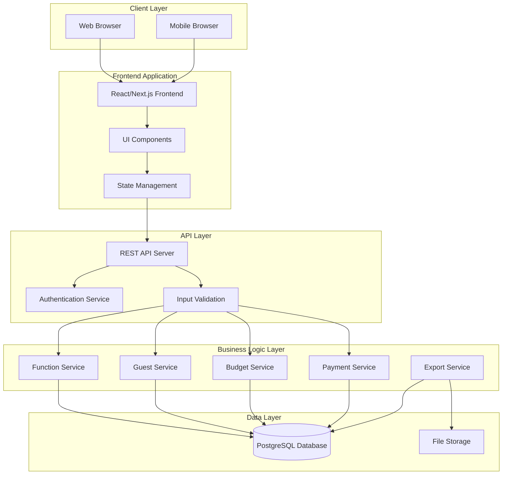
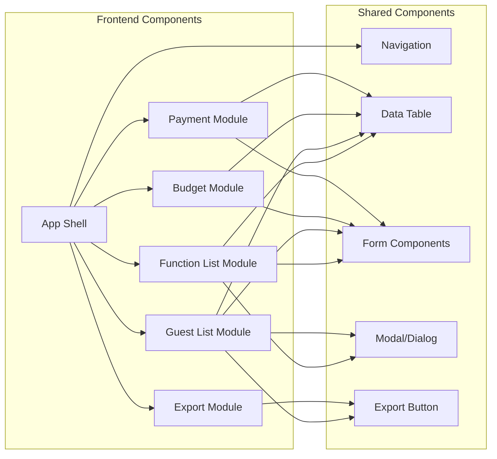
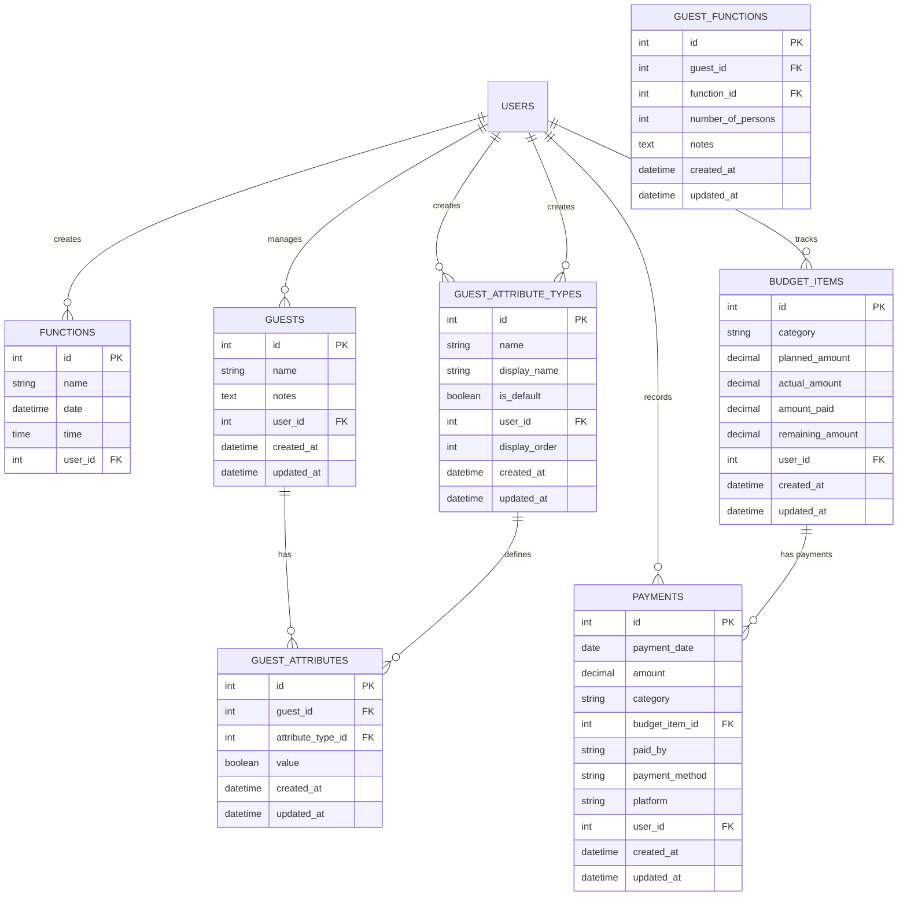
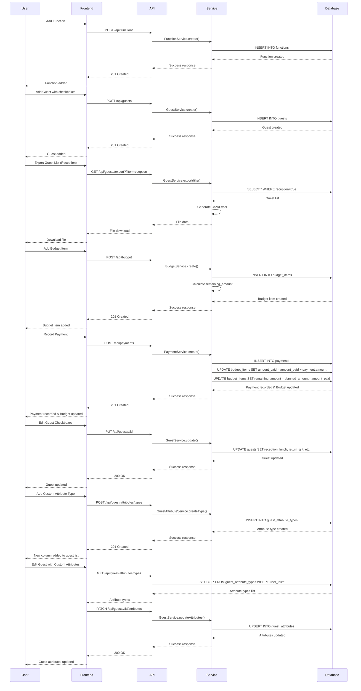
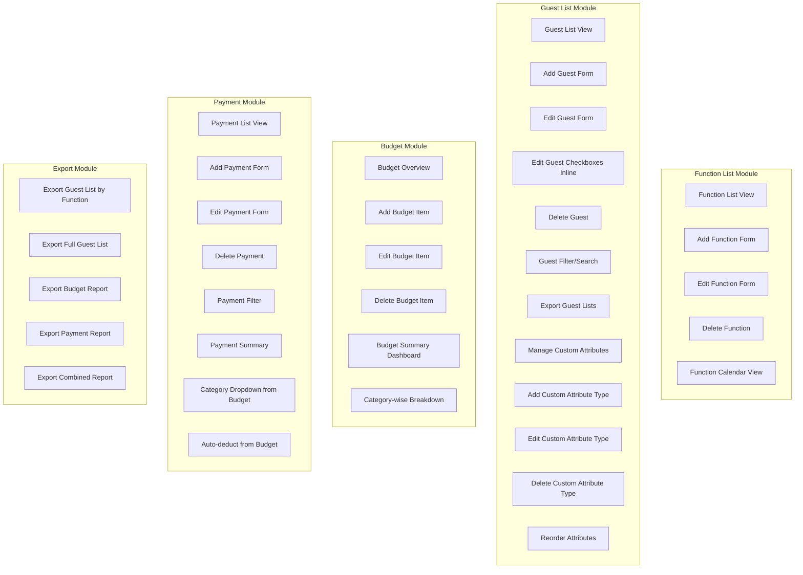
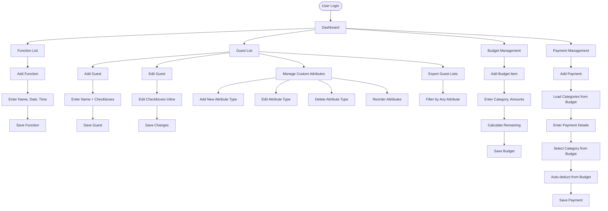
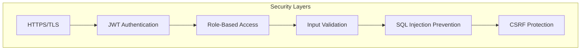
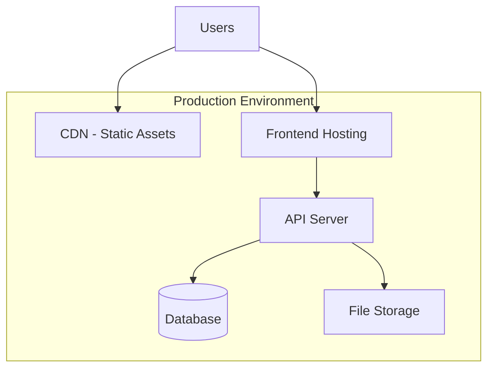

# Wedding Management Web App - Architecture Diagram

## 1. System Architecture Overview



## 2. Component Architecture



## 3. Database Schema Architecture

> **Note on `user_id`**: The `user_id` field in all tables (FUNCTIONS, GUESTS, BUDGET_ITEMS, PAYMENTS, GUEST_ATTRIBUTE_TYPES) is used for **multi-user support**. Each user can manage their own wedding independently. This ensures data isolation - when a user logs in, they only see and manage their own functions, guests, budget, payments, and custom attribute types. This is essential for a multi-tenant application where multiple users can use the same system for their separate weddings.

> **Note on Dynamic Guest Attributes**: The guest list now supports **dynamic custom columns**! Instead of fixed columns in the GUESTS table, we use a flexible system:
> - **GUEST_ATTRIBUTE_TYPES**: Stores custom attribute types (columns) that users can create (e.g., "Lunch", "Dinner", "Return Gift", "Reception", "Haldi", "Mehendi", etc.)
> - **GUEST_ATTRIBUTES**: Stores the actual values (checkboxes) for each guest-attribute combination
> - **Default Attributes**: System provides default attribute types (Lunch, Dinner, Return Gift, Ceremony) that users can customize
> - **Easy Management**: Users can add, edit, delete, and reorder custom attributes just like managing functions
> - **Unlimited Flexibility**: No schema changes needed - users can add as many custom columns as needed



## 4. Data Flow Architecture



## 5. Module Breakdown



## 6. Technology Stack Recommendation

### Frontend
- **Framework**: React.js / Next.js
- **State Management**: Redux Toolkit / Zustand
- **UI Library**: Material-UI / Ant Design / Tailwind CSS
- **Form Handling**: React Hook Form
- **Data Table**: TanStack Table / Material-UI DataGrid
- **Export**: SheetJS (xlsx) / CSV export

### Backend
- **Runtime**: Node.js
- **Framework**: Express.js / Nest.js
- **ORM**: Prisma / TypeORM / Sequelize
- **Validation**: Joi / Zod
- **Authentication**: JWT / Passport.js

### Database
- **Primary DB**: PostgreSQL
- **ORM**: Prisma (recommended)

### Deployment
- **Frontend**: Vercel / Netlify
- **Backend**: AWS / Railway / Render
- **Database**: AWS RDS / Supabase / Railway PostgreSQL

## 7. API Endpoints Structure

```
/api
├── /auth
│   ├── POST /register
│   ├── POST /login
│   └── POST /logout
├── /functions
│   ├── GET / (list all)
│   ├── POST / (create)
│   ├── GET /:id (get one)
│   ├── PUT /:id (update)
│   └── DELETE /:id (delete)
├── /guests
│   ├── GET / (list all)
│   ├── POST / (create)
│   ├── GET /:id (get one)
│   ├── PUT /:id (update - including attributes)
│   ├── PATCH /:id/attributes (update only attributes)
│   ├── DELETE /:id (delete)
│   └── GET /export?filter=attribute_name (export filtered)
├── /guest-attributes
│   ├── GET /types (list all attribute types)
│   ├── POST /types (create new attribute type)
│   ├── GET /types/:id (get one attribute type)
│   ├── PUT /types/:id (update attribute type)
│   ├── DELETE /types/:id (delete attribute type)
│   ├── PUT /types/reorder (reorder attribute types)
│   └── GET /types/defaults (get default attribute types)
├── /budget
│   ├── GET / (list all)
│   ├── POST / (create)
│   ├── GET /:id (get one)
│   ├── PUT /:id (update)
│   ├── DELETE /:id (delete)
│   └── GET /summary (get summary)
├── /payments
│   ├── GET / (list all)
│   ├── POST / (create - auto-deducts from budget)
│   ├── GET /:id (get one)
│   ├── PUT /:id (update - recalculates budget)
│   ├── DELETE /:id (delete - reverses budget deduction)
│   ├── GET /summary (get summary)
│   └── GET /categories (get categories from budget)
└── /export
    ├── GET /guests/:type (export guest list)
    ├── GET /budget (export budget)
    └── GET /payments (export payments)
```

## 8. Feature Flow Diagram



## 9. Security Architecture



## 10. Deployment Architecture



---

## Key Design Decisions

1. **Modular Architecture**: Each feature (Functions, Guests, Budget, Payments) is a separate module for maintainability
2. **RESTful API**: Standard REST endpoints for easy integration and scalability
3. **Relational Database**: PostgreSQL for data integrity and complex queries
4. **Export Functionality**: Server-side export generation for better performance
5. **Real-time Calculations**: Budget remaining amount calculated automatically when payments are made
6. **Dynamic Guest Attributes**: Users can create, edit, and delete custom attribute types (columns) for guests. Default attributes (Lunch, Dinner, Return Gift, Ceremony) are provided, but users can add custom ones like "Reception", "Haldi", "Mehendi", etc.
7. **Flexible Guest Attributes**: Guest attributes are stored in a flexible many-to-many relationship, allowing unlimited custom columns without schema changes
8. **Payment-Budget Integration**: Payments automatically deduct from budget items, and payment categories are populated from existing budget categories
9. **Guest Management**: Guests can be edited after creation, including updating attributes inline. Custom attributes can be reordered and managed easily
10. **User Isolation**: `user_id` in all tables ensures multi-user support - each user manages their own wedding data independently, including their custom attribute types
11. **Guest-Function Details**: `GUEST_FUNCTIONS` table stores additional information like number of persons and notes for each guest-function relationship
12. **Attribute Type Management**: Users can add/edit/delete/reorder custom attribute types, making the guest list fully customizable to their wedding needs

